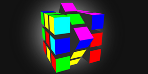

Rubik3
======

**Intuitive 3D Rubik Cube for Desktop and Mobile with `Three.js`**

13kB minified

### Live Example
* [3D Rubik](https://foo123.github.io/examples/rubik3/)

**see also:**

* [Billiard.js](https://github.com/foo123/Billiard.js) Billiard game in pure JavaScript
* [sudoku.js](https://github.com/foo123/sudoku.js) Sudoku game in pure JavaScript
* [chess.js](https://github.com/foo123/chess.js) Chess game in pure JavaScript
* [sunfish.js](https://github.com/foo123/sunfish.js) JavaScript port of Sunfish chess engine
* [Rubik3](https://github.com/foo123/Rubik3) 3D Rubik Cube game in pure JavaScript
* [3DRubikCube](https://github.com/foo123/3DRubikCube) 3D Rubik Cube game in ActionScript

